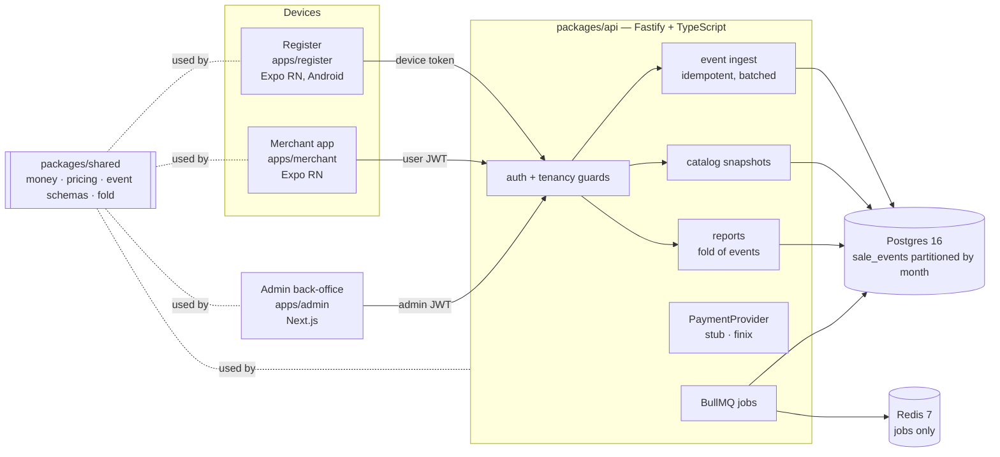
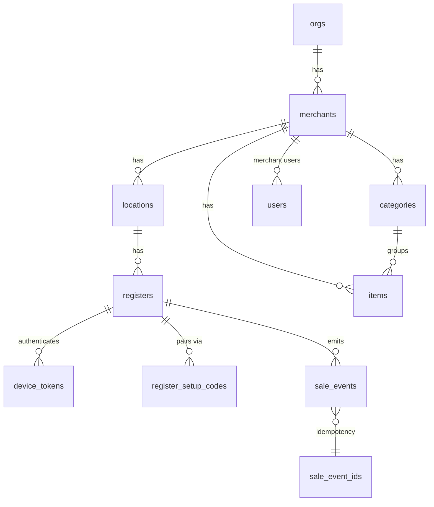

# Step 1 — Foundation: shared schemas, Postgres, tenancy, auth

Build sequencing step 1 (`CLAUDE.md`). This doc covers what exists after this step, how the pieces fit,
and what is deliberately left for later steps. Decisions that outlive this step live in
[`docs/decisions/`](../decisions/).

## Architecture

Everything runs locally (ADR 0007): `pnpm dev` starts Postgres and Redis in Docker, then the API
(:3000), admin (:3001), merchant app (:8081) and register (:8082).

## packages/shared

| Module | What it owns |
| --- | --- |
| `money.ts` | Branded `Cents` (safe integers only), add/sub/sum/mulQty, `applyRateHalfUp` (BigInt, one rounding), `parseUsdToCents` (no floats), `formatUsd` (display edge only). Rates are integer **ppm**: 6.625% = `66_250`. |
| `pricing.ts` | Dual pricing (`deriveCardPrice`, `resolveDualPrice`, explicit card-price override), tax computed **per rate group** and rounded once. |
| `events.ts` | Zod schemas for every register event type, versioned. Payloads are **strict** — unknown keys are rejected, so there is no field a PAN, track data or CVV could travel in. |
| `fold.ts` | `foldSale(events)`: the one definition of what a sale adds up to, in both price modes. Detects a device-declared total that disagrees with the fold. |
| `packs.ts` | Vertical pack interface; `cstore` implemented, `liquor` / `restaurant` / `grocery` stubs. |
| `api.ts` | Wire types shared by API and clients. |

## Data model

Tenancy is `org → merchant → location → register`. Every row below the org carries all tenancy ids
above it (composite foreign keys keep them consistent), so any row can be scoped without a join.

| Table | Notes |
| --- | --- |
| `orgs`, `merchants`, `locations`, `registers` | `merchants.enabled_packs` is the pack config; `locations` carries `tax_rate_ppm` and `dual_price_rate_ppm`. |
| `users` | `kind = admin` (AD Pay staff, null tenancy, email + scrypt password) or `merchant_user` (one merchant, phone + OTP). |
| `otp_challenges` | Hash of the code only; 5-minute expiry, 5 attempts, 5 requests per 15 min per phone. |
| `register_setup_codes` | One-time, 24h (30 days for seeded codes), stored as SHA-256. Issuing a new one expires the old. |
| `device_tokens` | Opaque `dev_…` tokens, stored as SHA-256, revocable. Re-pairing revokes every earlier token. |
| `categories`, `items` | Money is `BIGINT` cents. `card_price_cents` NULL → derived from the location rate. `attrs jsonb` holds pack-specific data (e.g. case-break). |
| `sale_event_ids` | Global primary key on the device-generated `event_id` — the idempotency guarantee. |
| `sale_events` | The immutable ledger, **partitioned by month of `received_at`**. Update, delete and truncate raise errors (trigger). `business_date` is server-assigned. |
| `audit_log` | Append-only record of admin actions and login attempts. |

**Idempotency.** A partitioned table can only enforce uniqueness together with its partition key, so
`event_id` is made globally unique in `sale_event_ids`, inserted in the same transaction as the
ledger row. Replaying any batch writes nothing and reports every id as a duplicate.

**Partitions.** `ensure_sale_events_partition(ts)` creates a month on demand. A BullMQ job keeps the
current and next two months created, and ingest calls it defensively (cached per process).

**Business date.** It is the location-local date of the device's `occurred_at`, unless that clock is
implausible: ahead of the server, or more than 7 days behind (beyond the 72h offline window). In
that case the server receive time decides.

## Auth and tenancy

| Principal | Credential | Scope |
| --- | --- | --- |
| Admin | email + password → 12h JWT (HS256, `aud=adpay-api`) | cross-tenant; every write audited |
| Merchant user | phone + OTP → 12h JWT carrying `org_id`, `merchant_id` | one merchant |
| Register | setup code → long-lived opaque device token | one register |

- Tenancy comes **only from the credential**. Merchant routes contain no merchant id in path or body;
  device ingest rejects any event whose tenancy differs from the token's.
- Cross-tenant reads return **404**, not 403, so they don't confirm that an id exists elsewhere.
- Every log line is JSON with `org_id`, `merchant_id`, `location_id`, `register_id` (null until
  known) and `trace_id` (from `x-trace-id` / `traceparent`, or minted, and echoed back).

## API surface (step 1)

| Method | Path | Who |
| --- | --- | --- |
| GET | `/health` | public |
| POST | `/auth/admin/login` | public |
| POST | `/auth/merchant/otp/request`, `/auth/merchant/otp/verify` | public |
| POST | `/auth/device/pair` | public (setup code) |
| GET | `/auth/me` | any |
| GET | `/admin/tenancy` | admin |
| POST | `/admin/orgs`, `/admin/merchants`, `/admin/locations`, `/admin/registers` | admin |
| POST | `/admin/registers/:id/setup-code` | admin |
| GET | `/admin/merchants/:id/catalog`, `/admin/merchants/:id/sales/summary` | admin |
| GET | `/admin/sales`, `/admin/sales/:saleId` (timeline replay), `/admin/audit` | admin |
| GET | `/merchant/overview`, `/merchant/catalog`, `/merchant/sales`, `/merchant/sales/summary`, `/merchant/sales/:saleId` | merchant user |
| GET | `/device/identity`, `/device/catalog` | register |
| POST | `/device/events` (≤ 500 per batch, idempotent) | register |

## Payments

`packages/api/payments/`: `provider.ts` (the interface), `stub/` (approves, deterministic, idempotent
per key), `finix/` (placeholder that throws until step 6), and `index.ts`, the single switch on
`PAYMENT_PROVIDER`. ESLint forbids importing Finix, reaching `payments/finix/`, or reading `FINIX_*`
anywhere else, and a test walks the repo to double-check. See ADRs 0003 and 0006.

## Tests

- `packages/shared`: money and rounding, dual pricing, grouped tax, strict event schemas (floats and
  card fields rejected), fold with voids and refunds and duplicates, and a property test that a day of
  random sales reconciles to the cent.
- `packages/api` on PGlite with the real migrations: admin login (and audit), OTP single use,
  setup-code single use and re-pair revocation, wrong-principal routes, **cross-tenant writes and reads
  refused**, **idempotent replay**, per-event rejection, **immutability triggers**, on-demand
  partitions, reports that reconcile with tender and exclude voids, dual price in the catalog snapshot,
  the stub provider, and the Finix import boundary.

## Open items this step leaves on purpose

| Item | When |
| --- | --- |
| Admin token lives in `sessionStorage`; move to an httpOnly cookie via a Next route handler (`ADMIN_SESSION_SECRET`) before any non-local deploy | before first deploy |
| Request rate limiting beyond OTP (login brute force) | before first deploy |
| OpenTelemetry traces and Sentry wiring (`trace_id` is already on every log line) | step 3 |
| WebSockets for live pushes and remote actions | step 3 |
| Catalog editing with version bumps, and "push to devices" | step 4 |
| Feature flags table | step 3–4 |
| NJ/NY taxability per category must be confirmed with an accountant. The seed follows the spec (lottery and tobacco carry the non-taxable flag), but NJ does charge sales tax on cigarettes | before pilot |
